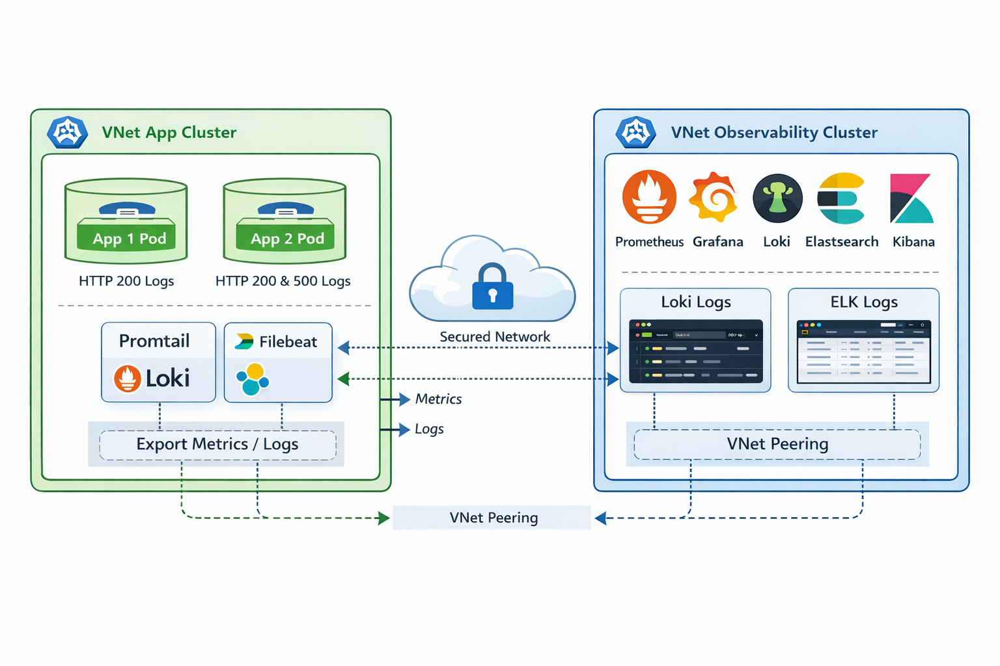

# 🔎 Multi-Cluster Observability Architecture with Terraform on Kubernetes



---

## 📌 Sobre o Projeto

Este projeto implementa uma arquitetura de observabilidade distribuída baseada em dois clusters Kubernetes isolados em **VNets separadas**, provisionados e gerenciados via **Terraform**:

- 🟢 **Cluster de Aplicações**
- 🔵 **Cluster de Observabilidade**

O objetivo é:

- Gerar logs e métricas em um cluster isolado
- Exportar esses dados para outro cluster
- Centralizar observabilidade
- Comparar ingestão e consulta de logs via **Loki** e **ELK Stack**
- Monitorar métricas com **Prometheus**
- Visualizar tudo no **Grafana**

Simula um cenário real de produção multi-ambiente com segregação de responsabilidades.

---

# 🏗️ Arquitetura da Solução

## 🔵 Cluster 1 – Observability Cluster

Responsável por:

- Prometheus
- Grafana
- Loki
- Elasticsearch
- Logstash
- Kibana

Este cluster é isolado em sua própria VNet/Subnet.

Recebe métricas e logs remotamente do cluster de aplicações.

---

## 🟢 Cluster 2 – Application Cluster

Responsável por:

- Duas aplicações de teste:
  - App 1 – Geração de logs HTTP 200 frequentes
  - App 2 – Geração de logs HTTP 200 e 500 simulados
- Exportação de métricas via Prometheus
- Exportação de logs via:
  - Promtail → Loki
  - Filebeat → Logstash (ELK)

Este cluster está em VNet separada, com comunicação controlada via peering.

---

# 🌐 Topologia de Rede

- VNet-App (Cluster Aplicação)
- VNet-Observability (Cluster Monitoramento)
- VNet Peering configurado
- NSGs restringindo tráfego
- Comunicação apenas nas portas necessárias

Segregação garante:

✔ Isolamento  
✔ Segurança  
✔ Simulação de ambiente corporativo real  

---

# 📊 Stack de Observabilidade

## 🔎 Métricas

- Prometheus
- Node Exporter
- Kube State Metrics
- Remote Scraping entre clusters

## 📜 Logs

### Loki Stack
- Promtail (no cluster app)
- Loki (cluster observability)
- Consulta via Grafana

### ELK Stack
- Filebeat (cluster app)
- Logstash (cluster observability)
- Elasticsearch
- Visualização via Kibana

---

# ⚙️ Aplicações de Teste

Duas aplicações simples (exemplo: Node.js ou .NET Minimal API):

### App 1
- Endpoint `/health`
- Retorna 200 constantemente
- Gera log a cada request

### App 2
- Endpoint `/`
- 80% status 200
- 20% status 500 simulados
- Logs estruturados (JSON)

Logs incluem:
- Timestamp
- Status code
- Latência
- Hostname
- Correlation ID

---

# 🔄 Fluxo de Dados

1️⃣ Aplicação gera log  
2️⃣ Log é coletado por Promtail e Filebeat  
3️⃣ Logs enviados para:
   - Loki
   - Logstash → Elasticsearch  
4️⃣ Métricas expostas via `/metrics`  
5️⃣ Prometheus faz scrape remoto  
6️⃣ Grafana centraliza dashboards  

---

# 📂 Estrutura de Pastas Recomendada (Terraform)

```
multi-cluster-observability/
├── modules/
│   ├── vpc/
│   │   ├── main.tf
│   │   ├── variables.tf
│   │   └── outputs.tf
│   ├── cluster-app/
│   │   ├── main.tf
│   │   ├── variables.tf
│   │   └── outputs.tf
│   ├── cluster-observability/
│   │   ├── main.tf
│   │   ├── variables.tf
│   │   └── outputs.tf
│   ├── network-peering/
│   │   ├── main.tf
│   │   ├── variables.tf
│   │   └── outputs.tf
│   └── helm-charts/
│       ├── prometheus/
│       ├── loki/
│       └── elasticstack/
├── environments/
│   ├── dev/
│   │   ├── main.tf
│   │   ├── variables.tfvars
│   │   └── backend.tf
│   └── prod/
│       ├── main.tf
│       ├── variables.tfvars
│       └── backend.tf
├── scripts/
│   ├── deploy-apps.sh
│   └── metrics-export.sh
├── README.md
└── .gitignore
```

**Descrição:**

- **modules/** – Módulos Terraform para VPCs, clusters Kubernetes e Helm charts  
- **environments/** – Configurações por ambiente (dev, prod)  
- **scripts/** – Scripts auxiliares para deploy de apps e coleta de métricas  
- **README.md** – Documentação do projeto  
- **.gitignore** – Ignorar arquivos sensíveis e estados do Terraform  

---

# 🚀 Provisionamento com Terraform

## 1️⃣ Inicializar Terraform

```bash
terraform init
```

## 2️⃣ Validar e Planejar

```bash
terraform plan -var-file=variables.tfvars
```

## 3️⃣ Aplicar Infraestrutura

```bash
terraform apply -var-file=variables.tfvars --auto-approve
```

### Recursos Provisionados

- Duas VPCs separadas
- Clusters Kubernetes gerenciados (EKS ou AKS/GKE)
- Network Peering entre clusters
- NSGs/Segurança de rede
- Helm Charts:
  - Prometheus Stack
  - Loki Stack
  - ELK Stack
- Aplicações de teste
- Dashboards Grafana configurados
- Centralização de logs e métricas

---

# 🔐 Segurança Aplicada

- Clusters em VNets separadas
- Network Policies no Kubernetes
- TLS entre componentes
- RBAC configurado
- Secretos via Kubernetes Secrets
- Comunicação restrita via NSG

---

# 📈 Resultados Técnicos

✔ Dois clusters isolados e comunicando via peering  
✔ Logs ingeridos simultaneamente em Loki e ELK  
✔ Métricas centralizadas  
✔ Dashboards funcionais  
✔ Simulação realista de ambiente corporativo  

---

# 📚 Aprendizados Aplicados

- Arquitetura multi-cluster Kubernetes
- Observabilidade distribuída
- Comparação prática Loki vs ELK
- Segurança em redes segmentadas
- Remote scraping Prometheus
- Logs estruturados e correlação
- Provisionamento automatizado com Terraform
- Padronização de Helm Charts

---

# ⭐ Se este projeto foi útil

Considere:

- Dar uma estrela ⭐
- Compartilhar com sua rede
- Contribuir com melhorias

---

> Este projeto demonstra arquitetura multi-cluster com centralização de observabilidade, provisionada com Terraform, comparando Loki e ELK Stack em ambiente isolado.
